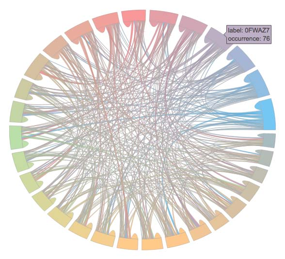

### Pandas dataframe inspection, filtering, balancing [![Build Status][travis-badge]][travis-link] [![MIT License][license-badge]](LICENSE)

The main goal of this package is to make your life easier if you want to:

- Inspect a dataset and compute metrics about its columns content (auto type inference: numeric, mono-label or multi-label).
- Filter the dataset one some criteria (minimum label occurrence, empty example).
- Balance the dataset (TODO) in order to get better performance while training ML or NN models.

### Requirements

- Python 2.7 or 3.6
- Numpy and Pandas

### Usage

1. Command line inspection

You can gain insight into your dataset, getting, among other things, label count, max/min/mean label occurrences (for mono and multi label columns).

```python
# Dataframe with numeric, mono-label, or multi-label (list, tuple, set) columns
df = pd.DataFrame(...)

# Filter label not occurring much in column 'B'
from datadez.filter import filter_small_occurrence
df = datadez.filter.filter_small_occurrence(df, column_name='B', min_occurrence=3)

# Filter empty row based on column 'B' or 'C' values
from datadez.filter import filter_empty
df = filter_empty(df, column_names=['B', 'C'])

# Compute some metrics about your dataset
import pprint
from datadez.summarize import summarize
df_summaries = summarize(df)
pprint.pprint(df_summaries)
```

2. Visual inspection

```python
# Dataframe with a multi-label column 'C'
df = pd.DataFrame(...)

# Compute a plotly figure from this dataframe
from datadez.dataviz import multilabel_plot
figure = multilabel_plot.intersection_matrix(df, 'C')

# Plot the figure in a file. You can also do this inside a Jupyter notebook
from plotly.offline import plot
plot(figure, filename='chord-diagram.html')
```

Output will look like this:



3. Transformation

With this code snippet:

```python
# Dataframe with numeric, text, mono-label, multi-label (list, tuple, set) columns
df = pd.DataFrame(...)

print("Original dataset:")
print(df.head())

# Vectorize text, mono-label and multi-label columns
from datadez.transform import vectorize_dataset
df, vectorizers = vectorize_dataset(df)

print("Vectorized dataset:")
print(df.head())
```

One will get:

    Original dataset:
              A       B                                 C                                D
    0 -0.585248  W2SIF2                                []     house jumps adorable crazily
    1  0.569125  RYKAXC  [IRX7HF, AXQU0L, PM1E1Q, 1FCWZQ]            car swims odd merrily
    2 -0.076040  7UVFIJ  [60WILH, NT28YD, 8IYE5F, 7UVFIJ]  monkey barfs clueless dutifully
    3 -0.098878  U9WN5M                  [KS5EXD, YGTPR9]           boy runs odd dutifully
    4  0.952773  SK1Z1M                          [AXQU0L]            boy barfs odd crazily
    
    Vectorized dataset:
              A      C                                                          ...        D
          value 1BNK1S 1FCWZQ 246K1M 3A48BH 60WILH 6C3VOQ 6LGS3T 7UVFIJ 8IYE5F  ...  merrily monkey occasionally odd puppy rabbit runs stupid swims weeps
    0 -0.585248      0      0      0      0      0      0      0      0      0  ...        0      0            0   0     0      0    0      0     0     0
    1  0.569125      0      1      0      0      0      0      0      0      0  ...        1      0            0   1     0      0    0      0     1     0
    2 -0.076040      0      0      0      0      1      0      0      1      1  ...        0      1            0   0     0      0    0      0     0     0
    3 -0.098878      0      0      0      0      0      0      0      0      0  ...        0      0            0   1     0      0    1      0     0     0
    4  0.952773      0      0      0      0      0      0      0      0      0  ...        0      0            0   1     0      0    0      0     0     0
    
    [5 rows x 85 columns]

### Do some tests

Just clone this repository, and execute:

    python -m tests.sample
    
This will execute a test sample, for you to get what's going on:

    Starting from this dataframe (len=100):
              A       B                                 C                               D
    0  0.745236  BBM7UP  [TUT7RS, MOW92W, 9O6IX6, T70X4Z]    donkey barfs dirty foolishly
    1  0.484822  GPC8CL  [BG05XJ, IORYVC, BX9UK5, ERT4PJ]    girl hits clueless dutifully
    2  0.673377  BK3OE7  [GPC8CL, GPC8CL, GPC8CL, BG05XJ]  car eats clueless occasionally
    3  0.462564  AEAIH6                                []          car eats dirty crazily
    4 -0.115847  T70X4Z                                []      girl hits adorable crazily
    
    With these metrics:
    {u'A': {u'column_type': u'numeric',
            u'mean': 0.048246178299744653,
            u'std': 0.95162789611877563},
     u'B': {u'column_type': u'mono-label',
            u'imbalance_ratio': 6,
            u'labels': 30,
            u'occurrence_max': 6,
            u'occurrence_mean': 3.3333333333333335,
            u'occurrence_min': 1,
            u'occurrence_std_dev': 1.4452988925785868},
     u'C': {u'cardinality_mean': 1.6499999999999999,
            u'cardinality_std_dev': 1.3955285736952863,
            u'column_type': u'multi-label',
            u'imbalance_ratio': 5,
            u'labels': 29,
            u'occurrence_max': 10,
            u'occurrence_mean': 5.6896551724137927,
            u'occurrence_min': 2,
            u'occurrence_std_dev': 2.1189367580327199,
            u'partitions': {u'imbalance_ratio': 29,
                            u'labels': 65,
                            u'occurrence_max': 29,
                            u'occurrence_mean': 1.5384615384615385,
                            u'occurrence_min': 1,
                            u'occurrence_std_dev': 3.4555503761871074}},
     u'D': {u'column_type': u'mono-label',
            u'imbalance_ratio': 2,
            u'labels': 98,
            u'occurrence_max': 2,
            u'occurrence_mean': 1.0204081632653061,
            u'occurrence_min': 1,
            u'occurrence_std_dev': 0.14139190265868387}}
    
    Filtering the small occurrences label of columns B and C...
    We now get this (len=100):
              A       B                                 C                               D
    0  0.745236  BBM7UP                  [MOW92W, 9O6IX6]    donkey barfs dirty foolishly
    1  0.484822  GPC8CL          [BG05XJ, IORYVC, ERT4PJ]    girl hits clueless dutifully
    2  0.673377  BK3OE7  [GPC8CL, GPC8CL, GPC8CL, BG05XJ]  car eats clueless occasionally
    3  0.462564  AEAIH6                                []          car eats dirty crazily
    4 -0.115847  T70X4Z                                []      girl hits adorable crazily
    
    
    Filtering empty entry example for column B or C...
    
    We finally have a clean dataframe (len=47):
              A       B                                 C                               D
    0  0.745236  BBM7UP                  [MOW92W, 9O6IX6]    donkey barfs dirty foolishly
    1  0.484822  GPC8CL          [BG05XJ, IORYVC, ERT4PJ]    girl hits clueless dutifully
    2  0.673377  BK3OE7  [GPC8CL, GPC8CL, GPC8CL, BG05XJ]  car eats clueless occasionally
    5 -0.941320  7A37D6                          [76AYX1]    girl eats clueless dutifully
    6  0.043402  7A37D6                          [BK3OE7]     rabbit jumps stupid merrily
    
    With these metrics:
    {u'A': {u'column_type': u'numeric',
            u'mean': 0.14122463494338683,
            u'std': 0.9745937014876852},
     u'B': {u'column_type': u'mono-label',
            u'imbalance_ratio': 5,
            u'labels': 20,
            u'occurrence_max': 5,
            u'occurrence_mean': 2.3500000000000001,
            u'occurrence_min': 1,
            u'occurrence_std_dev': 1.0618380290797651},
     u'C': {u'cardinality_mean': 1.7872340425531914,
            u'cardinality_std_dev': 0.84893350396851086,
            u'column_type': u'multi-label',
            u'imbalance_ratio': 3,
            u'labels': 15,
            u'occurrence_max': 9,
            u'occurrence_mean': 5.5999999999999996,
            u'occurrence_min': 3,
            u'occurrence_std_dev': 1.5405626677721789,
            u'partitions': {u'imbalance_ratio': 4,
                            u'labels': 36,
                            u'occurrence_max': 4,
                            u'occurrence_mean': 1.3055555555555556,
                            u'occurrence_min': 1,
                            u'occurrence_std_dev': 0.69997795379745287}},
     u'D': {u'column_type': u'mono-label',
            u'imbalance_ratio': 1,
            u'labels': 47,
            u'occurrence_max': 1,
            u'occurrence_mean': 1.0,
            u'occurrence_min': 1,
            u'occurrence_std_dev': 0.0}}

[travis-badge]:    https://travis-ci.org/dezounet/datadez.svg?branch=master
[travis-link]:     https://travis-ci.org/dezounet/datadez
[license-badge]:   https://img.shields.io/badge/license-MIT-007EC7.svg
